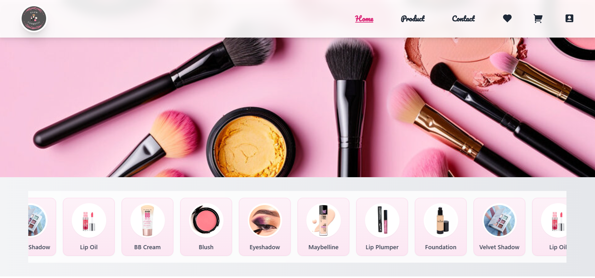
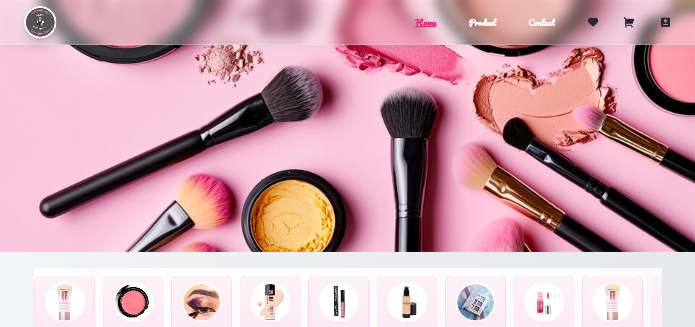
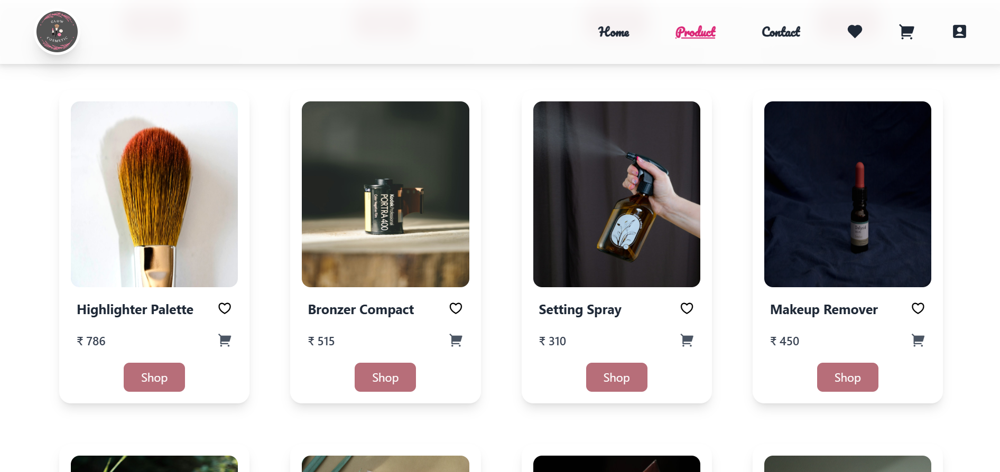

# 💄 Makeup Beauty Store - E-Commerce Frontend

A modern and responsive frontend e-commerce website for makeup and beauty products.  
Built using **React** and styled with **Tailwind CSS**, this project showcases a clean user interface with product listings, categories, and a shopping cart layout.

---

## 🌟 Project Preview



---

## 🚀 Features

- 🛍️ Product listing with images, price, and name  
- 🛒 Shopping cart UI (Add/Remove items)  
- 📱 Fully responsive design  
- 🎨 Stylish and modern layout using Tailwind CSS  

---

## 🛠️ Tech Stack

- ⚛️ **React** (Vite setup)  
- 🎨 **Tailwind CSS**  
- 📜 **JavaScript**  
- 🖼️ **HTML**  

---

## 📸 Demo / Screenshots  

### 🏠 Homepage  



### 🛒 Product Page  


---

## 📂 Project Structure  

├── src
│ ├── components # Reusable React components
│ ├── pages # Page components
│ ├── assets # Images & icons
│ └── App.jsx # Main app file
├── public
│ ├── preview.png
│ ├── homepage.png
│ ├── categories.png
│ └── product.png
└── README.md


---

## ⚡ Getting Started

Follow these steps to run the project locally:

```bash
# Clone the repository
git clone https://github.com/Nehameena28/E-commerce.git

# Navigate into the project
cd E-commerce

# Install dependencies
npm install

# Start the development server
npm run dev


---

📞 Contact Me

📧 [Email](mailto:neham.bba2023@ssism.org)  
💼 [LinkedIn](https://www.linkedin.com/in/contact-neha-meena)  
🐙 [GitHub](https://github.com/Nehameena28)  


